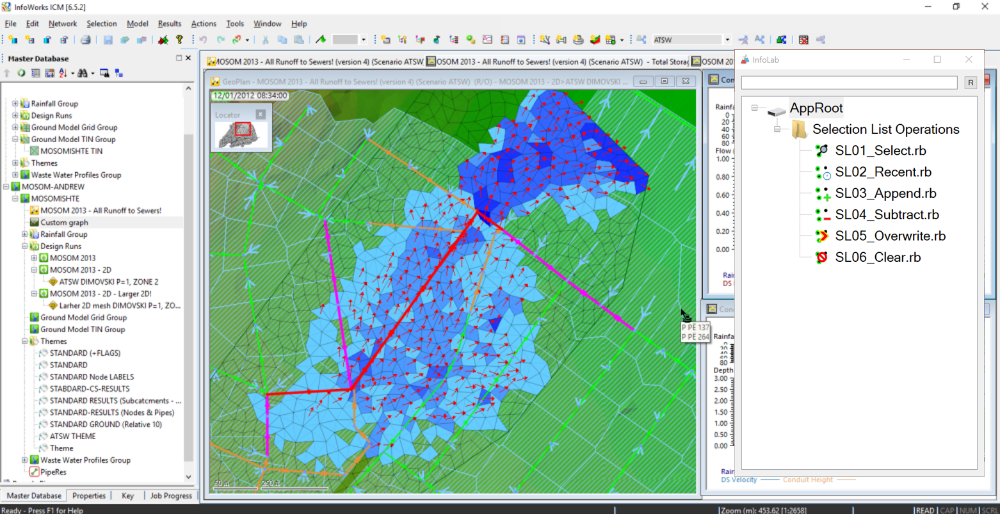

# InfoLab

The first 3rd party open source InfoWorks ICM and InfoNet tool for dynamic execution of Ruby scripts!

]

## Description

InfoLab adds a tool window to InfoWorks/InfoNet which allows you to execute and run ruby scripts instantly

Simply double click on a ruby script to execute it! You can also search in the database of ruby scripts in the search bar for scripts you need.

The scripts and icons can be found in `./scripts/`. If you want to add scripts to the collection, just drop them into this folder. You can also optionally include a png file which will act as it's icon. Ensure this file has the same name as the ruby script but with the `.rb.png` extension:

```
scripts/myScript.rb      <-- Script
scripts/myScript.rb.png  <-- Image
```

If you do not supply an image, a default image will be used instead. Click refresh if your new script doesn’t display immediately.

You can also run multiple ruby scripts sequentially. Select multiple scripts and press enter, you will be prompted by a message asking:

> You have selected more than one script. Would you like to execute them all sequentially?

Click yes to run both scripts sequentially.

## Compatibility Table

| InfoNet/InfoWorks ICM Version | InfoLab compatibility?|
|-------------------------------|-----------------------|
| 6.5                           | Yes                   |
| 7.0                           | UNK                   |
| 7.5                           | Yes                   |
| 8.0                           | Assumed yes           |
| 8.5                           | Yes                   |
| 8.5+                          | Assumed yes           |

If the compatibility table is yes, please do get in touch so we can make the tool compatible with your system!

## COM Extensibility

This tool is being built with a COM Dispatch API. This will allow additional clients to connect to the application and install their own plugins to the tree view. Documentation for this hasn't yet been written, but if their is interest I will absolutely write the documentation. However as a quick overview, you have to implement a specific IDispatch interface in order to connect to the application. The interface should provide the following methods:

```ahk
    class Plugin {
      ;Shell object supplied supports implements https://docs.microsoft.com/en-us/windows/desktop/shell/folderitem, could be IFile, or IFolder, or ...
      identify(shObj){
        return (ComObjType(shObj, "Name") == "IFolder") ;Return true if the shObj supplied is the same type as your plugin.
      }
      
      ;Returns a new instance of this object
      create(shObj,parent){
        return new this(shObj,parent)
      }
      
      __New(shFolder, oILL){
        ;Using type is best avoided but is beneficial to other programs viewing the COM model.
        this.type := "Folder"
        
        ;Name of folder in tree
        this.name := shFolder.name
        
        ;Disallow folders to be found by filtering - disallowed because it may look odd
        this.isFilterable := false
        
        ;Store reference to InfoLab window, important for debugging that you use parent.DebugMode
        this.parent := parent
        
        ;Set the icon as displayed within the tree view
        this.icon := img
        
        ;To handle children of this object use the children property
        ;InfoLab.handleChild identifies the child's class from the existing registered classes, and instantiates them. You can do this yourself also if you want to 
        ;bypass the current behaviour.
        this.children := []
        this.children.push(InfoLab.handleChild(someShOjectOfChild,parent))
        ;...
      }
      
      ;The execute method is performed when this item is double clicked.
      execute(){ 
        ;Perform execution
      }
      
      ;This method is trigerred when a user right clicks on your item. The InfoLab API provides a helper menu method to assist in creating your context menus.
      ;Ensure all function objects supplied have a call() method!
      ;More complex menus might have to be generated by yourself.
      openContext(){
        InfoLab._helperMenu({ "Execute all": this.execute.bind(this) 
                            ,"Open in explorer": this.openInExplorer.bind(this)}
                            ,true) ;Bare in mind the "true" here will auto-show the menu.
      }

      ;A bound method seen above.
      openInExplorer(){
        path := this.path
        Run %COMSPEC% /c explorer.exe /select`, "%path%",, Hide
      }
    }
```

## Future Features

* Full COM Exposure and perhaps an example VBScript implementation.
* Settings should be saved between sessions.
* Setting new script roots in the settings.
* Being able to bind to toolbar buttons and menu items to commands.

## License

The code in this repository is released under GPL software license as an attempt to force openness of derivative work.
